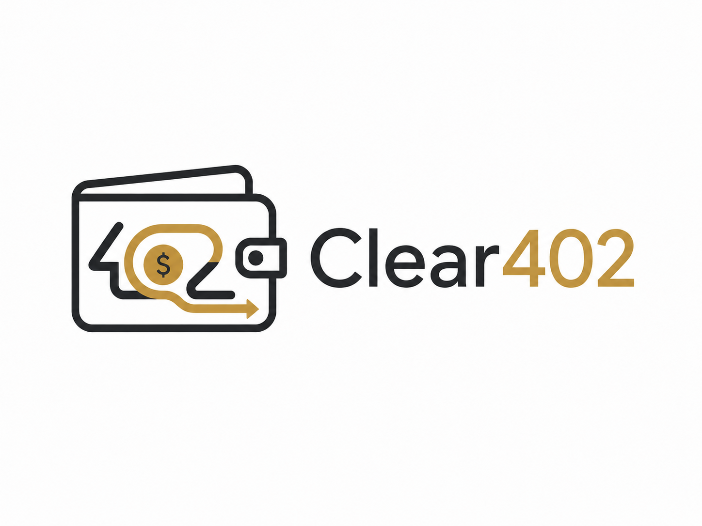

# Clear402



## One-Liner

Clear402 is a CAW-backed x402 guard and evidence workflow for safer agent-native HTTP 402 payments.

## Project Background

Clear402 is a hackathon demo, not a mainnet production product. It demonstrates how an agent-native HTTP 402 payment flow can be wrapped with provider validation, resource binding, metadata redaction, clear signing, receipt verification, attack-lab checks, and evidence export. Live CAW evidence is limited to the recorded Sepolia tiny transfer, recorded destination-allowlist denial, narrow message-sign verifications, and one EIP-3009 USDC transfer executed on Base Sepolia through CAW-approved contract_call.

## Why HTTP 402 / x402 Matters

HTTP 402 and x402 let services request payment inline, which is useful when autonomous agents buy data, model output, or services without a human checkout page. That flow also creates new risk: replayed proofs, cross-resource substitution, malicious provider discovery, hidden calldata, metadata leakage, and paid-but-denied delivery.

Clear402 treats an x402 payment as an evidence workflow. The payment header is only one input; the guard also binds the paid resource, provider identity, quote terms, wallet policy, signing intent, service receipt, and exported evidence.

The guard layers and attack-lab scenarios are mapped from four arXiv papers on x402 and agentic payment risks. See [Paper Mapping](./docs/paper_mapping.md) for the paper links, pain points, defenses, and 16 attack scenarios.

## What We Reuse From Cobo Agentic Wallet

- Official CAW CLI / SDK boundary through `@cobo/agentic-wallet`.
- CAW wallet identity and pact concepts for agent-controlled testnet payments.
- Recorded Sepolia allow-path evidence for one tiny `0.0001` SETH transfer.
- Recorded Sepolia destination-allowlist denial evidence for one rejected transfer.
- Official x402 HTTP 402 / dry-run parsing evidence through the official x402 Express example and `caw fetch --dry-run`.
- Official CAW gateway startup/listening/forwarding evidence through `caw payment gateway`.
- One EIP-3009 USDC transfer executed on Base Sepolia through CAW-approved contract_call.

Official CAW execute and gateway forwarding currently prove the permission boundary, not additional successful payments: execute and gateway forwarding reached CAW but stopped on `INSUFFICIENT_PERMISSION` / `can_transfer`. Having a testnet asset balance does not make a CAW operation executable without the right approved pact.

## What Clear402 Adds

- x402 challenge normalization and PaymentContext binding.
- Provider registry checks and ERC-8004 trust validation with explicit `live_erc8004` versus `demo_erc8004` provenance.
- Quote, nonce, budget, and replay locks.
- Metadata firewall and redacted evidence export.
- Clear-signing checks for malicious approval and hidden multicall behavior.
- Service receipt verification for paid-but-denied and malformed delivery paths.
- A 16-scenario attack lab that runs mock fixture inputs through the real guard pipeline.
- An operator dashboard that labels live, fallback, and mock evidence boundaries.

## Architecture

| Area | Path | Purpose |
|---|---|---|
| Dashboard | `apps/dashboard` | Next.js operator console for missions, challenges, guard status, attack lab, and evidence export. |
| Runtime | `services/runtime` | Guard pipeline, CAW adapter boundary, SQLite schema, evidence export, and attack-lab execution. |
| Provider | `services/provider-x402` | Local deterministic x402 provider, challenge, payment proof, receipt, and fixture helpers. |
| Shared contracts | `packages/shared` | Zod schemas and shared domain types. |
| E2E tests | `tests/e2e` | Playwright desktop/mobile dashboard flow and evidence export checks. |
| Evidence docs | `docs/live_caw_*.md` | Recorded Sepolia/testnet CAW evidence. |

## Setup

Requirements:

- Node.js `>=22.5.0`
- pnpm `>=10.33.2`

```bash
pnpm install
pnpm db:init
```

## Run Demo

Start the three local services:

```bash
pnpm --filter @clear402/runtime dev
pnpm --filter @clear402/provider-x402 dev
pnpm --filter dashboard dev
```

Default endpoints:

- Dashboard: `http://127.0.0.1:3000`
- Runtime health: `http://127.0.0.1:4000/health`
- Provider health: `http://127.0.0.1:4010/health`

The ordinary dashboard payment path is fallback/demo state unless it is explicitly backed by recorded live CAW evidence. The attack lab uses mock fixture inputs and real guard execution.

## Run Tests

```bash
pnpm lint
pnpm test
pnpm build
pnpm test:e2e
pnpm run attack:all
```

`pnpm test:e2e` runs Playwright dashboard E2E, runtime guard tests, and the attack lab gate. Browser artifacts are written under `e2e-results/` and are intentionally gitignored.

If the machine running E2E does not have Chrome/Chromium available, install the browser runtime first:

```bash
pnpm exec playwright install chromium
```

## Demo Video Script Link

- [Five-Minute Demo Script](./docs/demo_script.md)
- [Demo Operator Runbook](./docs/demo_operator_runbook.md)
- [Submission Package](./submission/README.md)
- [Demo Video Recording Script](./submission/demo-video/recording-script.md)
- [Demo Video Short Preview MP4](./submission/demo-video/clear402-demo-preview.mp4)
- [Presentation Deck - Google Slides](https://docs.google.com/presentation/d/1oCXVoHJQFKGSCqc57O6KIy-4vmzy6qyrXBj_BPEyrcY/edit)
- [Final Submit Checklist](./submission/final-submit-checklist.md)

The repository includes the presentation deck, recording script, and a short demo preview. The hackathon portal upload should use the final 3-5 minute demo video link or file, showing the dashboard flow, live/fallback/mock labels, evidence export, and 16/16 attack-lab result.

## Proposal Link

- [Hackathon Proposal](./docs/proposal.md)

## Evidence Links

All chain evidence below is Sepolia/testnet evidence.

| Evidence | Value |
|---|---|
| Agent wallet / source address | `0xab42bb255c4660b0879f007ab3ed9ae049d85859` |
| Allow-path CAW request ID | `clear402-live-caw-smoke-1781270885558` |
| Allow-path pact ID | `71e60376-8959-4f25-ab7e-83fc3e8e196c` |
| Allow-path tx hash | `0xf0f257dad181ec835c09e131177402c0d2073bf345ca13d394b6aaa170a69011` |
| Allow-path explorer | `https://sepolia.etherscan.io/tx/0xf0f257dad181ec835c09e131177402c0d2073bf345ca13d394b6aaa170a69011` |
| Policy-denial CAW request ID | `clear402-live-caw-denial-1781280971` |
| Policy-denial pact ID | `c3f6217f-dc9a-4cdd-9332-8e1661e4ab8e` |
| Policy-denial operation | Rejected Sepolia transfer to `0x000000000000000000000000000000000000dEaD` |
| Policy-denial result | `ADDRESS_NOT_WHITELISTED` / `policy_denied`, no tx hash produced |
| Official x402 HTTP 402 | Official x402 Express example from `x402-foundation/x402` commit `b32a702` returned a real HTTP 402 challenge |
| Official x402 dry-run | `caw fetch --dry-run` parsed the real 402 challenge without calling the payment API |
| Official x402 execute | Reached CAW but stopped on `INSUFFICIENT_PERMISSION` / `can_transfer`; no paid retry, tx hash, or successful payment claim |
| Official `message_sign` | Narrow typed-data pacts produced live allow-shaped signatures and policy-denied mismatches; do not generalize beyond the recorded exact typed-data shapes |
| Base Sepolia EIP-3009 tx | `0x91f1e0284380b6d50201c95b540e46a68c43cfe0f8e3a5a0c10a3c43fb222b6a` |
| Base Sepolia EIP-3009 explorer | `https://sepolia.basescan.org/tx/0x91f1e0284380b6d50201c95b540e46a68c43cfe0f8e3a5a0c10a3c43fb222b6a` |
| Base Sepolia EIP-3009 result | EIP-3009 USDC transfer executed on Base Sepolia through CAW-approved contract_call; source balance `20000000 -> 19999999`, recipient balance `20000000 -> 20000001`, authorizationState `false -> true` |
| Official gateway mode | `caw payment gateway` forward mode started, listened locally on `127.0.0.1:8404`, and forwarded the official x402 request; no payment execution or production settlement claim |

Detailed reports:

- [CAW Capability Report](./docs/caw_capability_report.md)
- [Live CAW Testnet Smoke Report](./docs/live_caw_testnet_smoke_report.md)
- [Live CAW Policy Denial Report](./docs/live_caw_policy_denial_report.md)
- [Sample Evidence Pack JSON](./evidence/sample_evidence_pack.json)
- [Sample Evidence Pack Markdown](./evidence/sample_evidence_pack.md)

The sample evidence pack is for demo packaging and review. It is sample/fallback/mock evidence and must not be used as proof of a live CAW payment.

## ERC-8004 Live Truth Status

Per the official ERC-8004 specification, live Identity truth is the ERC-721 Identity Registry `tokenURI` for an `(identityRegistry, agentId)` pair; live Reputation truth is read from Reputation Registry methods such as `getSummary(...)` and `readAllFeedback(...)`; live Validation truth is read from Validation Registry methods such as `getValidationStatus(...)`, `getSummary(...)`, `getAgentValidations(...)`, and `getValidatorRequests(...)`. The official `erc-8004-contracts` repo publishes registry contract addresses, and 8004scan exposes a public API/OpenAPI for indexed agent lookup.

Clear402 does not currently have a verified live ERC-8004 provider identity. A 8004scan public search for Clear402 did not return a matching registered provider, so runtime trust evidence must stay `needs_registration` / `fallback_required` unless a future run supplies a verified `live_erc8004` source.

## Security Boundaries

- Hackathon demo only; not a mainnet production product.
- Do not commit private keys, API keys, pairing tokens, seed phrases, wallet secrets, or `.env.caw.local` files.
- Use Sepolia/testnet evidence only.
- Ordinary dashboard payment is fallback/demo state.
- Live CAW evidence is limited to the recorded Sepolia tiny transfer, recorded destination-allowlist denial, narrow message-sign verifications, and one exact Base Sepolia EIP-3009 USDC tx.
- Official CAW CLI evidence also covers x402 dry-run parsing and local gateway startup/listening/forwarding; it does not add a successful x402 execute claim.
- Fresh raw CAW CLI stdout/stderr/meta/result evidence is indexed in `evidence/caw/live_verify_20260613T2214Z_summary.json`.
- Asset availability alone is not execution readiness. CAW operations require the right approved pact and operation permission.
- Attack lab inputs are mock fixtures, not external exploit traffic, but they run through the real guard pipeline.

See [Security Boundaries](./docs/security_boundaries.md) and [Limitations](./docs/limitations.md).

## Limitations

- The project does not claim mainnet readiness or unrestricted CAW execution.
- The recorded CAW allow path covers one tiny Sepolia transfer only.
- The recorded CAW denial covers one destination-allowlist rejection only.
- Official x402 dry-run evidence proves challenge parsing only; official execute currently stops on CAW pact permission.
- Official `message_sign` evidence covers narrow approved live signing and policy-denial checks only; do not generalize to arbitrary typed data, assets, recipients, pacts, or mainnet.
- Official gateway evidence proves local startup/listening/forwarding only, not payment execution or production gateway settlement.
- Provider registry, `demo_erc8004` trust, and capability seed data are demo records. `live_erc8004` trust requires a verified registered agent identity and matching endpoint/payTo evidence.
- Browser/E2E artifacts are local run evidence and are not committed.

## Third-Party APIs / SDKs / AI Tools

- Cobo Agentic Wallet SDK: `@cobo/agentic-wallet`
- Cobo CAW CLI: used for recorded Sepolia/testnet evidence capture
- x402-style local provider flow: implemented in `services/provider-x402`
- Next.js, React, Framer Motion, and Lucide React for the dashboard
- Zod for shared contracts
- Local signed provider quote, ServiceEscrow, dual-receipt, and clear-sign policy helpers in runtime/provider code
- TypeScript, tsup, Vitest, and Playwright for build/test gates
- SQLite-backed runtime schema
- AI-assisted development/review tools were used during project packaging; no AI provider API key is committed.

## Team Link

- [OriginShift Team](./docs/team.md) - public repo-safe team profile; wallet/contact details are supplied in the hackathon portal if required.

## Project Assets

- [Clear402 Logo](./docs/assets/project/clear402-logo.png)
- [Demo Video Short Preview MP4](./submission/demo-video/clear402-demo-preview.mp4)
- [Presentation Deck - Google Slides](https://docs.google.com/presentation/d/1oCXVoHJQFKGSCqc57O6KIy-4vmzy6qyrXBj_BPEyrcY/edit)
- [Submission Package](./submission/README.md)

## Additional Docs

- [Live / Fallback / Mock Policy](./docs/live_fallback_mock_policy.md)
- [Paper Mapping](./docs/paper_mapping.md)
- [Security Audit](./docs/security_audit.md)
- [Code Review](./docs/code_review.md)
- [Design Review](./docs/design_review.md)
- [Final Gate Report](./docs/final_gate_report.md)
