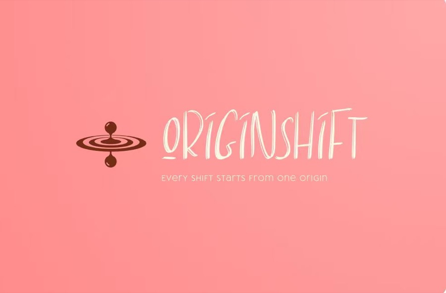

# Team

## OriginShift

OriginShift is the team behind Clear402.

## Core Philosophy

> Every shift starts from one origin.

This line from the OriginShift logo is the clearest expression of our team philosophy: meaningful change can begin from one precise origin, then grow through the work that follows.

## Logo Story

The OriginShift logo starts with water: water is one of the origins of life and movement. The small droplet represents the starting point of every change our team tries to create. Its reflection on the lake expresses our hope that careful work will return meaningful results. The ripple spreading across the water represents the impact we hope our work can have on the blockchain industry and, over time, possibly beyond blockchain as well.

## Members

| Member | Avatar | Current submission role | Wallet address | Contact |
|---|---|---|---|---|
| Qy |  | Project owner / submitter; Clear402 product, integration, and final packaging lead | To be provided in hackathon portal | To be provided in hackathon portal |
| Damia |  | Team member; demo narrative and review support | To be provided in hackathon portal | To be provided in hackathon portal |
| Max |  | Team member; technical review and presentation support | To be provided in hackathon portal | To be provided in hackathon portal |
| Chris |  | Team member; operations, testing, and submission support | To be provided in hackathon portal | To be provided in hackathon portal |

## Submission Notes

- Fill public wallet addresses in the hackathon portal if the form requires them.
- Fill contact details in the hackathon portal with information the team is comfortable submitting publicly or semi-publicly.
- Do not include private keys, API keys, seed phrases, pairing tokens, wallet secrets, private CAW environment values, or private personal contact details in this public repository.
- If one person covers multiple roles, update the role column before the final submission.
